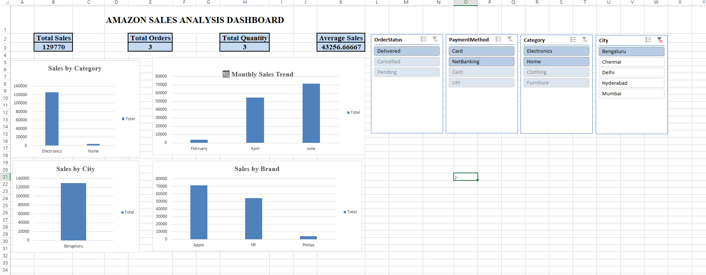

# 📊 Amazon Sales Analysis Dashboard — Excel

## 📌 Project Overview

This project analyzes Amazon sales data using Microsoft Excel and presents the results through an interactive sales dashboard.

The dashboard provides insights into sales performance across categories, cities, brands, months, payment methods, and order statuses.

The project demonstrates practical Excel skills used in data analysis and business reporting.

## 📸 Dashboard Preview

## 🎯 Objectives

- Analyze overall sales performance
- Identify top-performing categories and brands
- Compare sales across different cities
- Analyze monthly sales trends
- Understand order and payment patterns
- Create an interactive dashboard for business analysis
- Present key findings in an easy-to-understand visual format

## 🛠️ Tools & Skills Used

- Microsoft Excel
- Excel formulas
- IF / IFS / IFERROR
- SUM / AVERAGE / COUNT
- SUMIF / SUMIFS
- COUNTIF / COUNTIFS
- AVERAGEIF / AVERAGEIFS
- VLOOKUP
- XLOOKUP
- INDEX + MATCH
- PivotTables
- PivotCharts
- Slicers
- Conditional Formatting
- Dashboard Design

## 📊 Dataset

The dataset contains 20 Amazon sales records with information about:

- Order ID
- Order Date
- Customer Name
- City
- Category
- Product
- Brand
- Quantity
- Unit Price
- Discount
- Shipping Cost
- Payment Method
- Order Status
- Sales

## 📈 Dashboard KPIs

| KPI | Value |
|---|---:|
| Total Sales | 319,713 |
| Total Orders | 20 |
| Total Quantity | 31 |
| Average Sales | 15,985.65 |

## 📊 Dashboard Features

### Sales by Category
Shows total sales generated by each product category.

**Key finding:** Electronics generated the highest sales among the categories.

### Monthly Sales Trend
Shows sales performance from January to June.

**Key finding:** June recorded the highest monthly sales.

### Sales by City
Compares total sales across different cities.

**Key finding:** Bengaluru generated the highest sales.

### Sales by Brand
Shows total sales generated by different brands.

**Key finding:** Apple was the top-performing brand.

## 🎛️ Interactive Filters

The dashboard includes slicers for:

- Category
- City
- Payment Method
- Order Status

These filters allow users to interactively analyze specific segments of the sales data.

## 🔍 Key Insights

- Electronics was the highest-performing category.
- Bengaluru generated the highest sales among the cities.
- June recorded the highest monthly sales.
- Apple was the highest-performing brand.
- Slicers allow users to dynamically filter the dashboard.

## 📂 Project Files

- **Amazon Sales.xlsx** — Original sales dataset
- **Amazon-Sales-Analysis-Dashboard - Excel.xlsx** — Completed Excel dashboard
- **dashboard.png** — Dashboard preview image
- **README.md** — Project documentation

## 🚀 How to Use

1. Download the Excel dashboard file.
2. Open it using Microsoft Excel.
3. Go to the **Amazon Dashboard** sheet.
4. Use the slicers to filter the data.
5. Observe how the KPIs and charts update dynamically.

## 💡 What I Learned

Through this project, I practiced:

- Data analysis using Excel
- Data visualization
- PivotTables and PivotCharts
- Interactive dashboard creation
- Slicers and filtering
- Excel formulas
- Business insights and reporting

## 👩‍💻 Author

**Akshaya**

Aspiring Data Analyst | Excel | SQL | Python | Power BI

**Akshaya**

Aspiring Data Analyst | Excel | SQL | Python | Power BI
